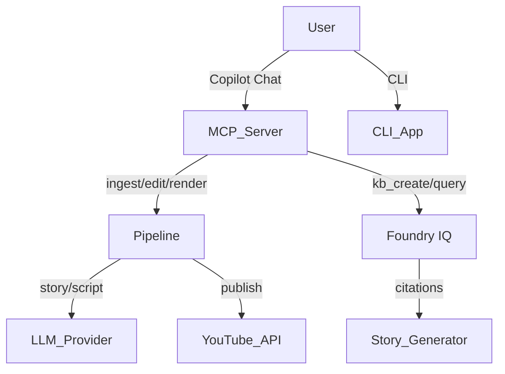

# ShortsForge ??

> **AI-powered short-form video studio** — repurpose long-form content, generate grounded stories, and publish YouTube Shorts from VS Code Copilot Chat or the terminal.

## Overview

ShortsForge integrates GitHub Copilot, Microsoft Foundry IQ, and an MCP server to create YouTube Shorts from long-form video, grounded story generation, and one-command publishing.

## Architecture



## Microsoft IQ Integration — Foundry IQ

ShortsForge integrates **Foundry IQ** (Azure AI Foundry agentic retrieval):

- Create knowledge bases from PDF, markdown, text, HTML, or URLs
- Story and script generation queries the KB before the LLM call
- Retrieved content is wrapped in injection-proof delimiters with guard preambles  
- Citations propagate through scenes to the rendered end-card

## Install

```bash
# Install uv (Windows)
irm https://astral.sh/uv/install.ps1 | iex

# Install FFmpeg: https://ffmpeg.org/download.html

uv sync --extra dev
cp .env.example .env   # fill in your API keys
```

## VS Code MCP Setup

The `.vscode/mcp.json` is pre-configured. Open VS Code in this folder and start Copilot Chat — the ShortsForge agent will be available.

## CLI Usage

```bash
shortsforge repurpose podcast.mp4 --niche "AI devtools" --count 3
shortsforge story --prompt "child finds a robot" --length 30 --tone soothing
shortsforge auth youtube
```

## Security

See [SECURITY.md](SECURITY.md). Key mitigations: path allow-lists, prompt injection guards, SSRF blocking, consent-gated publishing, OS keyring credentials, content moderation (fail-closed).

## GitHub Copilot Usage

Built end-to-end with GitHub Copilot Chat (agent mode with MCP tools) and inline chat for iterative refinement.

## Hackathon Submission Checklist

- [x] Copilot usage documented
- [x] Foundry IQ integrated (kb_create/ingest/query tools) (kb_create/ingest/query tools)
- [x] Security tests pass (25/25)
- [ ] Demo recorded
- [x] No secrets committed (detect-secrets baseline clean)
